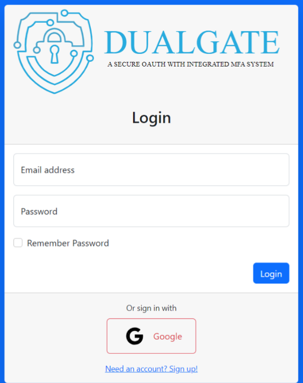
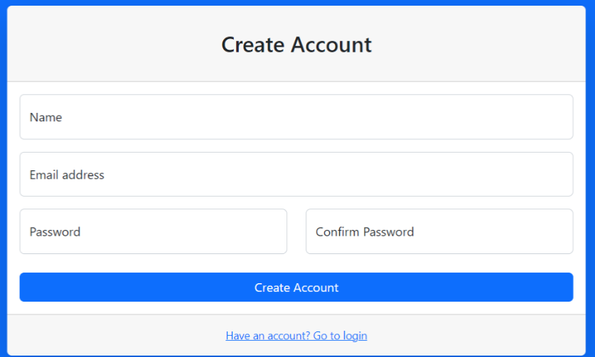
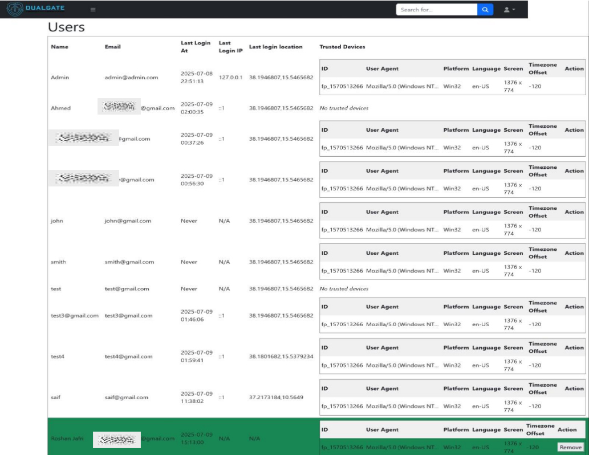
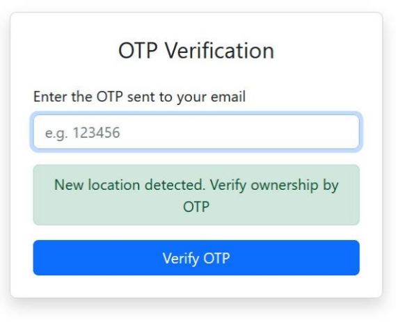
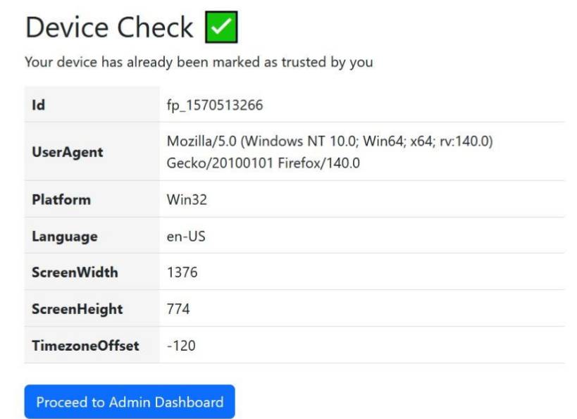

## INTRODUCTION

This project is a robust web application designed to provide secure user
authentication and comprehensive device management. It integrates advanced
security features like Multi-Factor Authentication (MFA) and OAuth, ensuring a
highly protected and user-friendly experience.
## PROGRAMMING LANGUAGES
#### PHP

Purpose: PHP is the primary server-side scripting language for this Laravel
web application. It handles all backend logic, including user authentication,
data processing, database interactions (via Eloquent ORM), routing, and API
handling.
#### JavaScript
Purpose: JavaScript is used for front-end interactivity, dynamic content,
and potentially for handling client-side aspects of device fingerprinting
and OAuth flows. It's compiled and bundled for efficient delivery to the
browser.
#### CSS (with Bootstrap CSS)
Purpose: CSS, specifically with the Bootstrap CSS framework, is used for
styling the web application. Bootstrap CSS provides utility classes for
building custom designs directly in the markup, which are then compiled
into a final CSS file.
#### HTML
Purpose: HTML forms the structure of the web pages. Laravel's Blade
templating engine is used to write clean, reusable HTML views with PHP
logic embedded.
#### SQL

Purpose: While not directly written as raw SQL files in most application
code, SQL commands are generated and executed by Laravel's Eloquent
ORM for all database operations (e.g., creating, reading, updating, and
deleting records).

## WORKFLOW
Initial Access: Users are redirected to the login page.
Authentication: Users can log in with their credentials or via Google.
OTP Verification: After successful login, if MFA is enabled, the
EnsureOtpIsVerified middleware redirects the user to an OTP verification form. An OTP is sent via email, and the user must enter it to proceed.
Device Check: The DeviceController handles device-related operations, including checking the current device and managing trusted devices. New device logins can trigger notifications.
Dashboard Access: Once authenticated and OTP-verified (if applicable), users can access the dashboard, which displays user information, including
login history and trusted devices.
Profile Management: Users can edit their profile information.

## SECURITY IMPLEMENTATIONS

Standard User Authentication:

#### Registration and Login: The User registration and login system
utilizes bcrypt hashing to ensure secure storage of passwords in the
database, the input fields are sanitized and protected against xss and
sql injections. The forms also utilize CSRF tokens to ensure the
requests are being made from the authorized point.
#### Email Verification: Users are required to verify their email addresses
adding a layer of security by ensuring the authenticity of user accounts
and preventing bot registrations.

#### Multi-Factor Authentication (MFA) / One-Time Password (OTP):

EnsureOtpIsVerified Middleware: This custom middleware is a critical
security implementation. It enforces a second factor of authentication

(OTP) after a user successfully logs in. This significantly reduces the risk
of unauthorized access even if primary credentials are compromised.

OTP Generation and Verification: The OtpController handles the
generation and verification of OTPs. A built in Mail façade handles the
transportation of OTP as however it’s on a local server it utilizes mailtrap
to simulate an SMTP server. The OTP code is session based and expires in
5 minutes. The OTP is linked to the user session and can’t be duplicated.

## WEBSITE PRESENTATION

The user can access the web application through the login page.

The registration page allows new users to create an account, providing
the necessary information to securely join the application

The dashboard or homepage serves as the central hub for authenticated
users, providing a personalized overview of their account, recent activities,

and access to key application features.

The OTP verification process adds an essential layer of security,
requiring users to enter a unique, time-sensitive code after initial login
to confirm their identity and prevent unauthorized access.

The device check feature verifies the authenticity of the login device,
allowing users to trust familiar devices for smoother access while flagging
unrecognized ones for enhanced security.

## CONCLUSION

In conclusion, this project demonstrates a strong commitment to security by
building upon Laravel's inherent protections with advanced features. Key
implementations include Multi-Factor Authentication (MFA) for enhanced
login security, comprehensive device management with trusted device
recognition and geolocation tracking, and proactive security notifications.
Furthermore, it leverages secure OAuth integrations with Google, all
contributing to a robust and multi-layered defense against unauthorized
access and common web vulnerabilities.
